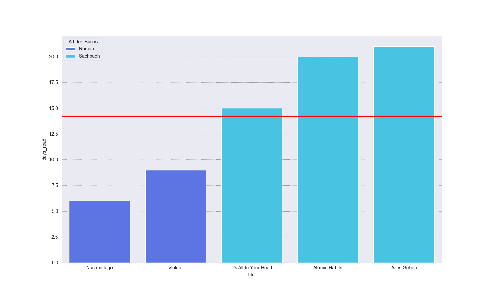

# Notion's Reading Recap

  

## Motivation

The notion workspace is perfect for organizing things such as read books and works well as 'digital bookshelf'. There is also the option to export the data as csv.
 
With Python and its powerful Pandas library we are able to analyse this data and create graphics on our reading behavior.

  

## Methods

## Screenshots

### Pages Per Day

### Days Read

### Monthly Pages - Type of Book

### Monthly Pages - Medium

### Monthly Pages - Language

